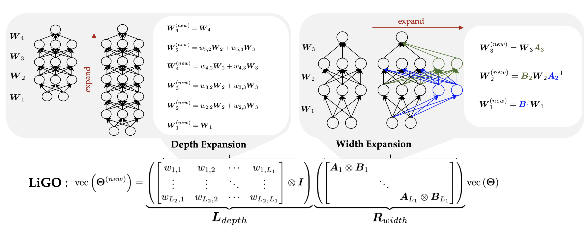

# Learning to Grow Pretrained Models for Efficient Transformer Training

[](https://opensource.org/licenses/MIT)

The official implementation of ICLR 2023 paper [Learning to Grow Pretrained Models for Efficient Transformer Training](https://arxiv.org/abs/2303.00980).

[Peihao Wang](https://peihaowang.github.io/)<sup>1</sup>,
[Rameswar Panda](https://rpand002.github.io/)<sup>2</sup>,
[Lucas Torroba Hennigen](https://ltorroba.github.io/)<sup>4</sup>,
[Philip Greengard](http://www.columbia.edu/~pg2118/)<sup>3</sup>,
[Leonid Karlinsky](https://scholar.google.com/citations?user=WbO7tjYAAAAJ&hl=en)<sup>2</sup>,
[Rogerio Feris](http://rogerioferis.com/)<sup>2</sup>,
[David Cox](https://mitibmwatsonailab.mit.edu/people/david-cox/)<sup>2</sup>,
[Zhangyang (Atlas) Wang](https://vita-group.github.io/)<sup>1</sup>,
[Yoon Kim](https://people.csail.mit.edu/yoonkim/)<sup>4</sup>

<sup>1</sup>University of Texas at Austin, <sup>2</sup>MIT-IBM Watson Lab, <sup>3</sup>Columbia University, <sup>4</sup>MIT



## Getting Started

### Dependency

To run our code, the following libraries which are required:

```
torch
torchvision
transformers==4.21.0
tensorboardX

# For GLUE evaluation
sklearn

# Fiass supports fast indexing.
# The code has a torch-implemented GPU indexing, so do not worry if you could not install faiss.
faiss-gpu>=1.6.3

# Spacy is used in sentence segmentation where the sentences are the input the cross-modality matching model.
spacy

# A higher h5py version to support h5py.VirtualLayout
h5py>=2.10.0
```

### Data Preparation

We re-use the data preparation pipeline provided by [Vokenization](https://github.com/airsplay/vokenization#vokenization-vokenization).

**1. Download and Pre-Process Pure-Language Data**

We provide scripts to get the English-Wikipeida dataset.

The script to download and process wiki data are modified from [XLM](https://github.com/facebookresearch/XLM). Note that the data processing pipelines for BERT and RoBERTa are different as they use different tokenizers.

To get data for training BERT, use the following command:
```
bash data/wiki/get_data_cased.bash en
```

For RoBERTa, it requires an untokenized version of English Wikipedia, so please use the following command:
```
bash data/wiki/get_data_cased_untokenized.bash en
```

**2. Tokenize Language Data**

We next tokenize the language corpus. It would locally save three files: `<dataset_name>.<tokenizer_name>`, `<dataset_name>.<tokenizer_name>.hdf5`, and `<dataset_name>.<tokenizer_name>.line`.
Use the following commands accordingly to tokenize the dataset:

```
# For BERT
bash tokenization/tokenize_wiki_bert.bash

# For RoBERTa
bash tokenization/tokenize_wiki_roberta.bash 
```

## Usage

Please use the following commands to pretrain BERT or RoBERTa:

### Training BERT from Scratch

(6L, 512H) BERT

```
python run_lm_distributed.py --config configs/bert_wiki.txt --config_name configs/bert-6L-512H.json --output_dir <output_path> --max_steps 400000 --warmup_steps 10000 --should_continue
```

(12L, 768H) BERT

```
python run_lm_distributed.py --config configs/bert_wiki.txt --config_name configs/bert-12L-768H.json --output_dir <output_path> --max_steps 400000 --warmup_steps 10000 --should_continue
```

### Training BERT with LiGO

First train a LiGO operator using the following command:

```
python run_grow_distributed.py --config configs/bert_wiki.txt --config_name configs/bert-12L-768H.json --output_dir <path_to_save_LiGO> --tune_width --tune_depth --source_model_path <path_to_small_model> --fuse_init_scheme stackbert_noisy rand --max_steps 100 --logging_steps 100 --ckpt_steps 100 --should_continue
```

Then use pre-trained LiGO operator to grow the model:

```
python run_lm_distributed.py --config configs/bert_wiki.txt --config_name configs/bert-12L-768H.json --output_dir <output_path> --grow_scheme ligo --source_model_path <path_to_small_model>  --pretrained_ligo_path <path_to_save_LiGO> --fuse_init_scheme stackbert_noisy rand --learning_rate 2e-4 --warmup_steps 0 --should_continue
```

### Training RoBERTa from Scratch

(6L, 512H) RoBERTa

```
python run_lm_distributed.py --config configs/roberta_wiki.txt --config_name configs/roberta-6L-512H.json --per_gpu_train_batch_size 64 --gradient_accumulation_steps 4 --learning_rate 2e-4 --output_dir <output_path> --should_continue
```

(12L, 512H) RoBERTa

```
python run_lm_distributed.py --config configs/roberta_wiki.txt --config_name configs/roberta-12L-768H.json --per_gpu_train_batch_size 64 --gradient_accumulation_steps 4 --learning_rate 2e-4 --output_dir <output_path> --should_continue
```

Note that the argument `--gradient_accumulation_steps 4` is necessary to gaurantee the batch size of RoBERTa is 4 times of BERT. One can use 4 times number of GPUs to achieve the same batch size.

### Training RoBERTa with LiGO

```
# Train LiGO
python run_grow_distributed.py --config configs/roberta_wiki.txt --config_name configs/roberta-12L-768H.json --per_gpu_train_batch_size 64 --gradient_accumulation_steps 4 --learning_rate 2e-4 --output_dir <path_to_save_LiGO> --tune_width --tune_depth --source_model_path <path_to_small_model> --fuse_init_scheme stackbert_noisy rand --max_steps 100 --logging_steps 100 --ckpt_steps 100 --should_continue

# Apply pre-trained LiGO operator to grow the model
python vlm/run_lm_distributed.py --config configs/roberta_wiki.txt --config_name configs/roberta-12L-768H.json --per_gpu_train_batch_size 64 --gradient_accumulation_steps 4 --output_dir <output_dir> --grow_scheme ligo --source_model_path <path_to_small_model> --pretrained_ligo_path <path_to_save_LiGO> --fuse_init_scheme stackbert_noisy rand --learning_rate 2e-4 --warmup_steps 10000 --should_continue
```

## Citation

This repository is based on the project [Vokenization](https://github.com/airsplay/vokenization#vokenization-vokenization).
If you find this work or our work helpful for your own research, please cite our paper.

```
@inproceedings{wang2023learning,
title={Learning to grow pretrained models for efficient transformer training},
author={Wang, Peihao and Panda, Rameswar and Hennigen, Lucas Torroba and Greengard, Philip and Karlinsky, Leonid and Feris, Rogerio and Cox, David Daniel and Wang, Zhangyang and Kim, Yoon},
booktitle={International Conference on Learning Representations},
year={2023},
url={https://openreview.net/forum?id=cDYRS5iZ16f},
}
```

